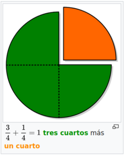
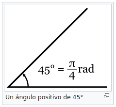
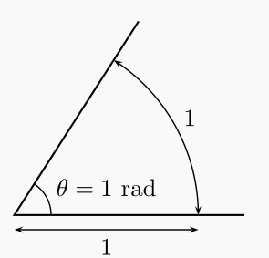
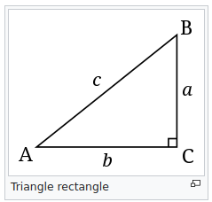

Repàs de matemàtiques (1 de 3)
==============================

Índex
-----

+ Fraccions
+ Magnituds, mesures i unitats.
+ Canvi d'unitats
+ Àrees
+ Volums
+ Unitats de temps

1.- Fraccions
-------------

### 1.1.- Definició

És la expressió d'una quantitat dividida entre una altra quantitat. En una fracció comuna a / b el denominador "b" expressa la quantitat de parts iguals que representen la unitat, i el numerador "a" indica quantes d'elles es prenen.

### 1.2.- Aritmètica amb fraccions

#### 1.2.1.- Fracció equivalent

Són equivalents les fraccions que representen el mateix però s'expressen de manera diferent, per exemple:

>  

Si divideixo la pizza en 2 trossos i en menjo un, és el mateix que dividir-la en 4 i menjar-ne 2.

#### 1.2.2.- Comparar fraccions

Si el denominador és igual, la fracció major és aquella que té el major numerador:

> 

Si els denominadors són diferents...

> 

Per a poder-les comparar primer hem d'igualar els denominadors, mitjançant la següent fórmula:

> 

Continuant amb l'exemple anterior:

> 

#### 1.2.3.- Suma de fraccions

Si les fraccions tenen el mateix denominador es sumen directament, és a dir:

> 

Si les fraccions no tenen el mateix denominador es procedirà de manera similar a la comparació:

> 

#### 1.2.4.- Multiplicació de fraccions

Es multipliquen els numeradors i els denominadors entre si:

> 

per exemple:

> 

#### 1.2.5.- Divisió de fraccions

Per a dividir dues fraccions es multiplica el numerador de la primera pel denominador de la segona, el resultat és el numerador de la fracció resultant. Per altra banda es multiplica el denominador de la primera pel numerador de la segona, el resultat és el denominador de la fracció resultant.

per exemple:

> 

2.- Magnituds, mesures i unitats
--------------------------------

### 2.1.- Magnitud

Una magnitud és una quantitat mesurable d'un sistema físic a la qual se li poden assignar diferents valors com a resultat d'un mesurament o una relació de mesures. Les magnituds físiques es mesuren usant un patró que tingui ben definida aquesta magnitud, i prenent com a unitat la quantitat d'aquesta propietat que posseeixi l'objecte patró.

Per exemple l'altura d'una persona és una magnitud. El pes en seria una altra. No obstant, la timidesa no ho és.

Dit d'una altra manera, és tota propietat d'un cos o sistema que pot ser mesurat.

### 2.2.- Unitat

Una unitat de mesura és una quantitat estandarditzada d'una determinada magnitud física, definida i adoptada per convenció o per llei.​ Qualsevol valor d'una quantitat física pot expressar-se com un múltiple de la unitat de mesura.

Una unitat de mesura pren el seu valor a partir d'un patró o d'una composició d'altres unitats definides prèviament. Les primeres unitats es coneixen com a unitats bàsiques o de base (fonamentals), mentre que les segones es diuen unitats derivades.

Un metro és una unitat de longitud, un kilogram de pes. Però una palada de grava no ho és (tret que totes les palades pesessin el mateix, és a dir que estigues estandarditzat).

### 2.3.- Mesura

La mesura és un procés bàsic de la ciència que es basa en comparar una magnitud física amb el seu patró per esbrinar quantes vegades està contingut el segon en el primer.

Es a dir si mesuro la meva altura, veure que és major que el patró (1 metre) però un poc menor que el doble del patró (2 metres) de fet és 1,80 metres. Però també ho hauria pogut mesurar en peus (5,91 peus).

Per altra banda puc dir que la meva alçada és 1,80 metres o utilitzar un submúltiple com el centímetre i afirmar que la meva altura és 180 cm.

3.- Canvi d'unitats
-------------------

Com hem vist una mateixa mesura es pot expressar en diferents unitats i submúltiples, i totes elles expressen la mateixa longitud.

Tot i que a la major part del mon s'utilitza el sistema internacional d'unitats moltes vegades s'utilitzen altres unitats per tradició o perquè el proveïdor és anglosaxó. Per exemple la potencia d'un cotxe es pot donar en kilowatts (kW) o bé en cavalls de vapor (CV).

Per altra banda és freqüent l'ús de múltiples i submultiples per no haver d'escriure que si he d'anar de Valencia a Badajoz faré 732.134m. És més fàcil de manejar dir que faré 732km. I per altra banda, dir que el diàmetre d'un pern és de 0,006m és incomode, es sol dir 6mm.

Per convertir una unitat en una altra multiplicarem la mesura per una fracció on al numerador hi hagi la unitat que volem i a numerador la unitat que tenim.

Per exemple, si sabem que 1 polsada són 2,54 cm un monitor de 42" mesurara...

> 

Per altra banda, per a passar d'una unitat a un múltiple a submúltiple es multiplica o es divideix per potències de 10 (es a dir per 10, 100, 1000, etc.)

Per exemple per passar de 500.000 bytes a MegaByte:

> 

4.- Àrees
---------

L'àrea és la mesura d'una unitat de superfície ja sigui d'un objecte de qualsevol dimensió. Normalment per calcular les àrees s'utilitzaran fórmules com les següents:

### 4.1.- Àrea d'un rectangle
> 
> 
> 
> A on:
> + A és l'àrea en m²
> + b és la base del rectangle en m
> + h és l'altura del rectangle en m

### 4.2.- Àrea d'un triangle rectangle

> 
> 
> A on:
> + A és l'àrea en m²
> + b és la base del triangle en m
> + h és l'altura del triangle en m

### 4.3.- Àrea d'un cercle

> 
> 
> A on:
> + A és l'àrea en m²
> + r és el radi en metres

### 4.4.- Àrea d'una esfera

> 
> 
> A on:
> + A és l'àrea en m²
> + r és el radi en metres

5.- Volums
----------

El volum és l'espai compres a dins d'un objecte de dimensió igual o superior a 3. Igualment que el cas anterior en general s'utilitzaran fórmules:

### 5.1.- Volum d'una esfera

> 
> 
> A on:
> + V és el volum en m³
> + r és el radi en metres

### 5.2.- Volum d'un prisma de base rectangular

> 
> 
> A on:
> + V és volum en m³
> + a és la longitud d'un costat de la base del prisma en m
> + b és la longitud de l'altre costat de la base del prisma en m
> + h és l'altura del prisma en m

### 5.3.- Volum d'un cilindre

> 
> 
> A on:
> + V és volum en m³
> + r és el radi en metres
> + h és l'altura del cilindre en m

6.- Unitats de temps
--------------------

La particularitat de les unitats de temps és que els múltiples del segon no són potencies de 10.

Es a dir si bé xerram de mili-segons, micro-segons, nano-segons que sí són potències de deu de la unitat del S.I. el minut (60s), l'hora(3600s), el dia (86400s), etc no ho són. De fet l'any no dura sempre el mateix i dissenyar els algoritmes per calcular els intervals de temps és una feina no trivial.

Sigui com sigui per passar d'una unitat a una altra utilitzarem els factors de conversió vists al punt _Canvid'unitats_.

--------------------------------------------------------------------------

Repàs de matemàtiques (2 de 3)
============================== 

Índex (Trigonometria)
---------------------

+ Angles
+ Teorema de Pitàgores
+ Raons trigonomètriques
+ Exercicis resolts

7.- Angles
----------

Un angle és la porció de pla limitada per dues semirectes anomenades costats amb origen comú anomenat vèrtex.

### 7.1.- Unitats de mesura d'angles.

Els angles en general es mesuren amb graus (unitat tradicional) i radians (sistema internacional).

#### 7.2.- Grau

Un grau és la divisió de la circumferència en 360 parts. Per això un gir complet són 360° o un angle recte 90°.

Un grau es divideix en 60 minuts (representats com a 60') i aquests darrers es divideixen a la seva vegada en 60 segons (representats com a 60").

Una possible mesura molt precisa d'un angle (per exemple per coordenades terrestres) podria ser: 39˚33'40,971", que és la latitud nord d'aquesta classe.

També es pot donar la mesura amb decimals del grau directament, per exemple l'angle de latitud anterior és 39.5613807˚en graus decimals.

#### 7.3.- Radians

En una circumferència de radi 1, el valor en radians de l'angle definit per un arc d'aquesta circumferència coincideix amb la longitud d'aquest arc. 

D'aquesta manera una circumferència tindrà 2π radians.

#### 7.3.1.- Conversió de graus a radians i viceversa

Es procedirà de manera anàloga a qualsevol canvi d'unitats. Tenint en compte que 360° són 2π rad, per convertir 30°a radians:

> 

#### 7.3.2.- Suma d'angles d'un triangle

La suma de tots els angles d'un triangle sempre és 180° o, el que és el mateix π rad.

Per tant si tenim un triangle rectangle i coneixem un dels seus altres angles, ja sabem l'angle que ens falta.

Per exemple si ens fixem en la següent imatge:

8.- Teorema de Pitàgores
------------------------

El teorema de Pitàgores, en el seu enunciat habitual, estableix que en un triangle rectangle la suma dels quadrats dels catets (els costats que formen l'angle recte) és igual al quadrat de la hipotenusa (l'altre costat).

Es a dir:

> 

Per exemple, si els catets d'un triangle mesuren 3 i 4 llavors la hipotenusa val 5, ja que:

> 

Un altre exemple seria, si la hipotenusa val 4 i un dels catets val 2, l'altre catet valdrà 3,46 ja que:

> 

9.- Raons trigonomètriques
--------------------------
El sinus d'un angle es calcula com la raó entre el catet d'enfront (aquell que no toca l'angle) dividit per la hipotenusa (el costat més llarg).

Per altra banda el cosinus es calcula com la raó entre el catet contigu (aquell que toca l'angle i no és la hipotenusa) i la hipotenusa.

Finalment la tangent d'un angle és la raó entre el catet d'enfront i el catet contigu o també la raó entre el sinus i el cosinus.

> 

Les funcions inverses són l'arcsinus, l'arccosinus i l'arctangent i ens permeten trobar l'angle a partir d'una raó trigonomètrica. És a dir:

> 

### 9.1.- Exercicis resolts

#### 9.1.1.- Exercici 1 de trigonometria

Si sabem que:
+ c = 8
+ A = 65°

Quan val B, a, b i l'àrea del triangle?

Si es coneixen 2 angles, podem trobar el tercer amb la fórmula:

> 

A més si es coneix l'angle A es pot calcular el seu sinus.

> 

Ara que ja es coneix el sinus de l'angle, donat que ja es té el valor de la hipotenusa, es pot trobar el catet oposat _a_ mitjançant:

> 

Tota aquesta operació es pot fer directament, és a dir:

> 

Per trobar c, es pot fer de dues maneres amb el cosinus de A o amb el teorema de Pitàgores, si es fa amb el cosinus es procedirà com en el cas anterior

> 

Per altra banda si es procedeix amb Pitàgores:

> 

Es comprova que, com és natural, ambdós resultats coincideixen.

#### 9.1.2.- Exercici 2 de trigonometria

Si es sap que:
+ c = 20
+ a = 10

Quan val A, B i b?

Si es coneixen 2 costats podem trobar l'angle a partir de:
+ el cosinus (si coneixem el catet contigu i la hipotenusa)
+ del sinus (si coneixem el catet oposat i la hipotenusa) 
+ o de la tangent (si coneixem els dos catets)

En aquest cas es coneix el catet oposat i la hipotenusa, per tant:

> 

Per tant:

> =30^\circ)

**Nota:** en algunes calculadores arcsin apareix com a sin-1

Ara obtenir B és trivial:

> 

Finalment per a trobar b, podem utilitzar tant Pitàgores com el cosinus:

> 

-----------------------------------------------------------------------------

Repàs de matemàtiques (3 de 3)
==============================

10.- Índex de sistemes d'equacions
----------------------------------

+ Sistemes de equacions
+ Mètode de substitució
+ Mètode d'igualació
+ Mètode de reducció

11.- Sistemes d'equacions
-------------------------

Un sistema d'equacions és un conjunt d'equacions amb diverses incògnites. Les incògnites poden aparèixer o no en totes les equacions. Per exemple:

> 

Per resoldre el sistema s'han d'obtenir els valors de les incògnites que fan que es compleixin totes les equacions alhora.
A continuació es resoldrà aquest sistema de dues equacions i dues incògnites pels tres mètodes bàsics: substitució, igualació i reducció.

### 11.1.- Mètode de substitució

Aquest mètode consisteix en aïllar una de les dues incògnites, per exemple la _x_, en una de les equacions i substituir aquesta expressió en l'altra equació. D'aquesta manera, s'obté una equació de primer grau. Continuant amb l'exemple:

> 

S'aïlla la x en la primera equació:

> 

Ara substituim la x per aquesta expressió i resolem:

> 

Si es coneix la y, ja es pot trobar la x:

> 

La solució es:

> 

### 11.2.- Mètode d'igualació

A partir del sistema d'equacions, s'aïllarà una de les dues incògnites, però ha de ser la mateixa en ambdues equacions:

> 

Una vegada aïllada la variable, s'igualen els costats no aïllats i es resol:

> 

I per tant:

> 

### 11.3.- Mètode de reducció

S'opera una de les dues equacions fins que ens permeti anular una de les variables de la segona. Per exemple multiplicant la primera per -2 es podrà sumar a la segona i anular la x:

> 

I després substituint en qualsevol de les dues equacións podrem trobar _x_

> 

### 11.4.- Sistema de 3 equacions amb 3 incògnites

> 

S'han d'escollir dues combinacions de dues equacions. S'escull per començar la primera i la segona, amb la finalitat d'eliminar la z.

> 

S'ha multiplicat la de baix per tal de que z desaparegui al sumar les dues expressions:

> 

Ara s'escull la segona combinació però s'ha d'eliminar la mateixa variable, per exemple la primera i la tercera:

> 

Ara es multiplica la de dalt per 2, i simplifiquem:

> 

Ara es té un sistema de 2 equacions amb 2 incògnites:

> 

Multiplicant la primera per -2:

> 

Ara es substitueix x a qualsevol de les equacions que tenien 2 incògnites, per exemple:

> 

I finalment es substitueix x e y a qualsevol de les primeres equacions, per exemple:

> 

BIBLIOGRAFIA
============

