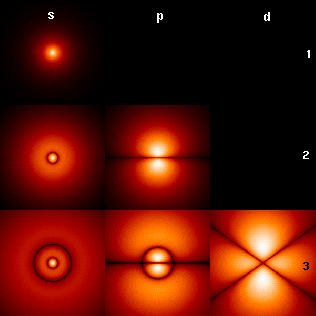
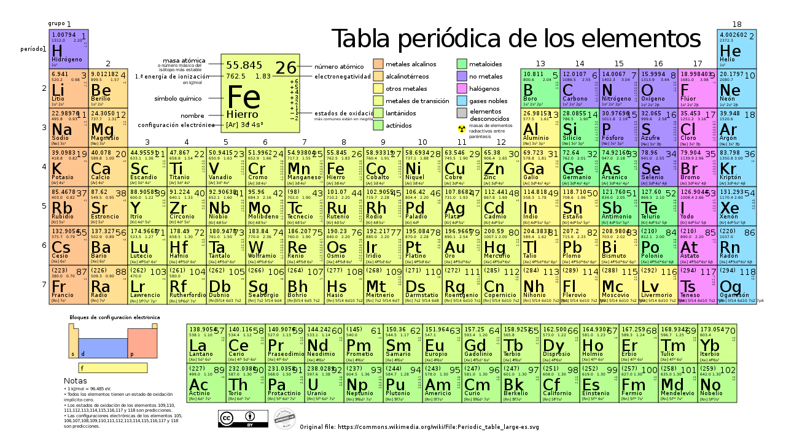
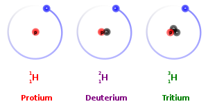
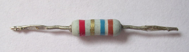
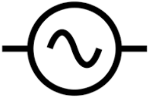
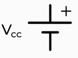
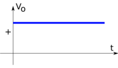
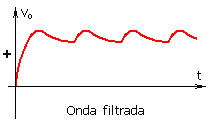
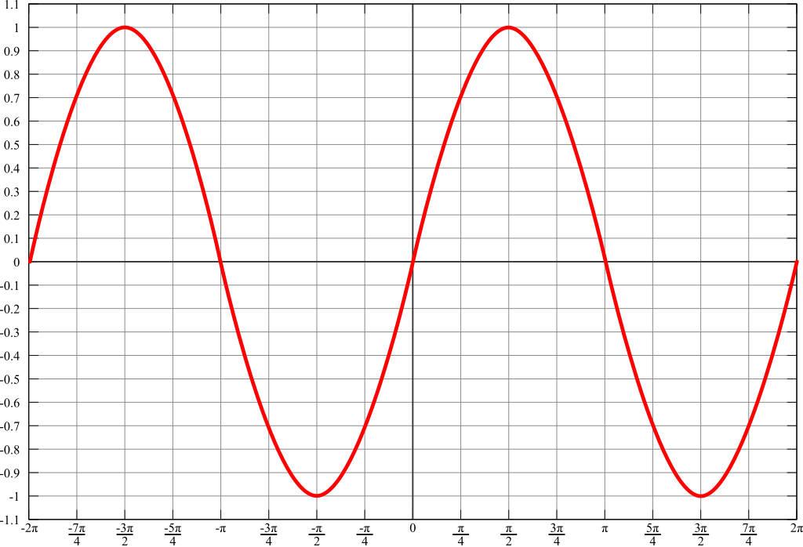

Introducció a l'electricitat
============================

Índex
-----

+ Generació i consum d'electricitat
+ Estructura atòmica i càrrega elèctrica
+ Resistència elèctrica
+ Llei de Coulomb i camp elèctric
+ Tensió, força electromotriu, i caiguda de tensió
+ Fonts d'alimentació
+ Intensitat de corrent
+ Circuit elèctric
+ Llei d'Ohm
+ Potencia i energia
+ Corrent continua i corrent alterna

1.- Generació i consum d'electricitat
-------------------------------------

Existeixen varies maneres de generar energia:

+ Reaccions químiques(piles i bateries)
+ Efecte fotoelèctric, piezoelèctric o termoelèctrics.
+ Transformant en energia elèctrica el moviment d'un fluid.

La darrera és la més emprada a l'hora de generar energia a les centrals elèctriques.

Per altra banda quan es consumeix energia  el que es fa és transformar-la en un altra tipus d'energia (so, calor, llum o moviment). Com als electrodomèstics, a la maquinaria, il·luminació, etc.

Un **alternador** és una màquina que transforma el moviment rotatori en energia elèctrica alterna. Una dinamo, fa el mateix però amb energia continua.

Cal recordar que és complicat emmagatzemar grans quantitats d'energia elèctrica, per això hi ha centrals que permanentment estan generant energia, i aquesta s'ajusta constantment al consum.

2.- Estructura atòmica i càrrega elèctrica
------------------------------------------

Tots els materials estan formats per molècules que a la vegada estan formades per àtoms. Aquests àtoms a la seva vegada estan formats per nuclis de protons i neutrons i al voltant hi ha núvols d'electrons.

Cada element de la taula periòdica te el mateix tipus de protons, i neutrons el que varia és la quantitat de protons, neutrons i electrons dels seus àtoms.

Si hi ha 1 protó parlem d'hidrogen, 2 protons heli, 3 protons liti, i així consecutivament tota la taula periòdica.

Si a l'àtom d'hidrogen afegim 1 protó es converteix en heli, però si li afegim un neutró, segueix essent hidrogen (es a dir, si el combinem amb oxigen formarà aigua), la diferència és que aquesta aigua serà més pesada. Aquest tipus d'àtoms es diuen isòtops. Els isòtops presenten més radioactivitat respecte al isòtop més estable (i per tant majoritari).

Finalment si a un àtom li afegim un electró aquest àtom s'anomenarà ió. Un àtom amb càrrega en aquest cas negativa. Si li robem un electró quedarà carregat positivament.

Si un àtom està carregat intentarà robar o cedir electrons als àtoms pròxims.

La electricitat es pot interpretar com una successió d'àtoms carregats que van passant un electró al següent àtom.

Segons la capacitat per a permetre el pas d'electrons distingirem entre:

+ conductors: Facilitat de l'electricitat per fluir a través d'ells. En el cas dels metalls els nuclis dels seus àtoms s'uneixen formant una xarxa que deixa els electrons lliures i amb gran mobilitat. S'utilitzen massivament el coure i l'alumini.
+ aïllants: els electrons estan fortament associats als nuclis o a les molècules i ofereixen gran resistència al pas d'electrons. Són el plàstic, el vidre, fusta, etc.
+ semiconductors: Són conductors en segons quines condicions i aïllants en altres, el seu representant més conegut és el silici. Són utilitzats en la industria electrònica.

3.- Resistència elèctrica
-------------------------

La resistència elèctrica és l'oposició que crea un material al pas de la corrent. La seva unitat és l'Ohm [Ω]. Depèn de la naturalesa del conductor, quan més bon conductor sigui menys resistència tindrà.

### 3.1.- Resistència del cablejat

Si es vol calcular la resistència d'un cable, hem de saber que aquesta augmenta amb la longitud i disminueix amb la secció. És a dir, com més llarg és un fil pitjor resistència; i com més gruixut, millor resistència.

La fórmula en aquest cas serà:

> 
> 
> **A on:**
> 
> + R és la resistència (en Ω)
> + ρ és la resistivitat (depèn del material), (en Ωmm²/m)
> + c és la conductivitat (en m/Ωmm²)
> + L és la longitud (en m)
> + S és la secció (en mm²)

Com que és més senzill recordar nombres sencers es sol utilitzar la conductivitat en comptes de la resistivitat. La conductivitat del materials més utilitzats és:

+ **coure:** 56 m/Ωmm² a 20°C 
+ **alumini:** 35m/Ωmm² a 20°C

### 3.2.- Exemples

#### 3.2.1.- Exemple 1

Determina la resistència a 20°C d'un cable de casa teva, per alimentar el forn de 6mm² de secció i longitud 20 metres:

> 

### 3.3.- Variació de la resistència amb la temperatura
La resistència dels metalls empitjora quan augmenta la seva temperatura, per tant, per càlculs més precisos s'haurà de tenir en compte la següent fórmula:

> ])
> 
> **A on:**
> 
> + R és la resistència a la temperatura (T) final en Ω
> + R1 és la resistència, en Ω a la temperatura de referència (T1). Normalment 20°.
> + α és el coeficient de variació per temperatura del material en Ω/°C. I es pot considerar 0,004Ω/˚C tant pel coure com per l'alumini.

#### 3.2.2.- Exemple 2

Què li passarà al cable d'abans si degut a la proximitat al forn la temperatura del mateix puja fins als 70°C?

> ]=0,05952\cdot[1+0,004(70-20)]=0.07142\Omega=71,42m\Omega)

### 3.4.- Comentaris finals

Els elements que s'encalenteixen molt com les resistències elèctriques de forns, bombetes incandescents el valor de la seva resistència varia molt des del moment de l'encesa al règim nominal.

Per altra banda, com s'ha comprovat als exemples la resistència del cablejat sol ser molt petita en front a la dels receptors i es pot negligir en molts de casos.

4.- Llei de Coulomb i camp elèctric
-----------------------------------

### 4.1.- Càrrega elèctrica

La càrrega elèctrica és una propietat física de les partícules subatòmiques (protons i electrons). Essent una càrrega positiva en el cas dels protons (o falta d'electrons en un àtom) i negativa en el cas dels electrons. Es mesura en coulombs (C).

### 4.2.- Llei de Coulomb

La llei de Coulomb diu que la força amb la que dues càrregues es repelen o s'atreuen és proporcional a la càrrega i inversament proporcional a la seva distància.

### 4.3.- Camp elèctric

Una altra manera d'interpretar la llei de Coulomb és mitjançant el concepte de camp elèctric. Quan es situa una càrrega a l'espai aquesta crea una pertorbació a l'espai de tal manera que quan una segona càrrega és creada experimenta una força deguda al camp creat per la primera. Aquesta pertorbació és el que s'anomena camp elèctric.

5.- Tensió, força electromotriu, i caiguda de tensió
----------------------------------------------------

El potencial elèctric o treball elèctric és l'energia necessària per moure una carrega dins d'un camp elèctric des d'un punt a un altre pres com a referència (i que és arbitrari).

El voltatge és la diferencia de potencial elèctric que hi ha entre dos punts qualsevol. O l'energia necessària per moure una càrrega des de dos punts qualsevol.

La força electromotriu (o voltatge induït) és tot allò capaç de crear i mantenir una diferencia de potencial o bé capaç d'injectar una corrent elèctrica en un circuit tancat.

Finalment la caiguda de tensió és la diferencia de potencial deguda a un receptor.

6.- Fonts d'alimentació
-----------------------

Una font d'alimentació és allò que proporciona energia a un circuit.

Una font de tensió per altra banda és una font d'alimentació capaç de proporcionar una força electromotriu al circuit, és a dir que crea i manté una tensió per si mateixa als seus extrems, com per exemple una pila, un alternador, un inversor, una placa fotovoltaica, etc. Es diuen fonts de tensió perquè idealment atorguen una tensió constant independent de l'energia que precisi el circuit.

El seu símbol és el següent:

+ Tensió alterna 
+ Tensió continua 

Una modelització més realista d'una font de tensió real podria ser:

> 
> 
> **A on:**
> 
> + VS és la Tensió de sortida de la font real
> + E és la força electromotriu de la font ideal i vi la caiguda de tensió deguda a la resistència interna.

7.- Intensitat de corrent
-------------------------

S'anomena corrent elèctrica al moviment ordenat de càrregues elèctriques. La seva unitat és l'ampere, que son les càrregues que travessen una secció per unitat de temps.

El sentit de la corrent per motius històrics és de positiu a negatiu, tot i que avui es coneix que el que es mou són els electrons els que circulen i que aquest tenen càrrega negativa.

El voltatge en certa manera s'assimilen a la pressió (o altura del depòsit) i la intensitat al flux d'aigua.

No perquè hi hagi tensió hi ha d'haver corrent. Per a que això succeeixi ha d'existir un camí.

8.- Circuit elèctric
--------------------

Es defineix el circuit elèctric com una serie d'elements interconnectats de tal manera que formen o poden formar un recorregut tancat.

A la figura es pot observar un generador i una càrrega (com una bombeta d'incandescència).

Quan es crea el circuit s'estableix un corrent elèctric, el generador crea el corrent necessari per impulsar-lo i el receptor la consumeix.

Per a que circuli la corrent s'ha de complir que:

+ Hi hagi una bateria
+ Hi ha d'haver una font d'alimentació

9.- Llei d'Ohm
--------------

La llei d'Ohm indica que la intensitat que circula a través de la resistència és directament proporcional a la diferencia de potencial aplicada als seus extrems, i inversament proporcional a la seva resistència.

> 
> 
> **A on:**
> 
> + V és la tensió en Volts
> + R és la resistència en Ohms
> + I és la intensitat en Amperes

Tot i que també es pot expressar com:

> 

És a dir com més resistència, tot i tenir un mateix voltatge la intensitat que circularà és menor. O per altra banda si es té un voltatge molt alt aconseguirem més intensitat a una mateixa resistència.

### 9.1.- exemple

Quina intensitat circula per un circuit amb una font de 24V i una resistència (bombeta) de 12Ω?

> 

Quina és la caiguda de tensió a un cable de 100m secció de 1,5mm², suposant una temperatura de 20°C, si per ella passa una intensitat de 10A?

> 
>
> 

Amb un polímetre dotat de pinça amperimètrica hem comprovat que, el voltatge d'un circuit és 230V, i la intensitat 1,5A. Quina és la resistència del circuit?

> 

10.- Potencia i energia
-----------------------

Es produeix una energia o treball elèctric quan es mouen les càrregues elèctriques. Als receptors (principalment), és on es consumeix aquesta energia.

### 10.1.- Potència

Per altra banda la potencia és el treball per unitat de temps. Dona una idea de com d'intens és el treball, molta potencia vol dir gastar (o produir) molta energia en poc temps.

La seva unitat és el watt (W), i amb els motors es sol utilitzar el cavall de vapor (1CV = 736W).

Per a calcular la potència d'un circuit elèctric, ens servirem de la següent expressió:

> 
> 
> A on:
> 
> + P és la potència en watts (W)
> + V és la tensió en volts (V)
> + I és el corrent en amperes (A)
> + R és la resistència en ohms (Ω)

### 10.2.- Energia

L'energia és el treball en sí mateix, és el que es consumeix el que crea moviment, calor o sò.

La energia consumida es pot interpretar com quan de temps està funcionant un receptor d'una potencia donada. És a dir:

> 
> 
> A on:
> 
> +  P és la potencia en W
> +  t és el temps en s
> 
> Segons aquesta fórmula l'energia és en watts segon (W·s) o, el que és el mateix, en joules (J):

> 

Donada una resistència, l'energia consumida es calcula com:

> 
> 
> A on:
> 
> + R és la resistència en Ω
> + I és el corrent en A
> + t és el temps en s
> + E és l'energia en J

No obstant si en aquestes fórmules en lloc d'utilitzar el segon com a unitat de temps utilitzem l'hora, en lloc de Ws (o J) obtindrem l'energia en termes de Wh.

Finalment si l'energia ronda els 1000 Wh podem utilitzar un prefixe d'escala, el quilo, i obtindrem una unitat molt utilitzada al món de l'electricitat, el kWh.

### 10.3.- Exercicis

#### 10.3.1.- Exercici 1
Si tinc una bombeta de 40W connectada a la xarxa domèstica (230V). Quina és la seva resistència?

> 

Es substitueix a la fórmula:

> 

#### 10.3.2.- Exercici 2

Què gasta més una bombeta LED de 20W encesa durant tot el vespre (8h) o un assecador de cabells de 1000W encès durant 10 minuts?

Primer es procedeix a calcular (per exemple) l'energia en kWh de la bombeta. 

> 

Ara es realitza el mateix càlcul amb l'assecador, però primer s'han de passar el minuts a hores:

> 

Ara ja es pot calcular calcular:

> 

Com es pot veure les xifres són molt semblants, gasta lleugerament més l'assecador, però a grans trets es pot afirmar que una bombeta LED de 20W consumeix en 8h el mateix que un assecador de 1000W en 10 minuts.

11.- Corrent continua i corrent alterna
---------------------------------------

Al capítol de les fonts es va parlar breument dels dos tipus de corrent amb el que el professional electricista es sol trobar: la corrent continua (CC o DC en anglès) i la corrent alterna (CA, AC en anglès).

### 11.1.- Corrent continua

És en la que les corrents es desplacen sempre en el mateix sentit, i poden ser constants (bateries) i no constants (alimentadors de portàtils o mòbils).

### 11.2.- Corrent alterna

És en la que la corrent oscil·la en ambdós sentits periòdicament. És la que produeixen els alternadors de les centrals tèrmiques, hidroelèctriques, nuclears, aerogeneradors.

Es senzilla de produir, els motors que l'utilitzen són de construcció senzilla i barata, i és fàcil transformar-la per a poder transportar-la. La seva forma és sinusoidal, com la de la figura següent:

A Europa la freqüència (quantes vegades es repeteix en 1 s) és de 50Hz, a USA és de 60Hz.

La seva amplitud és √2·230.

Una sinusoidal es troba totalment definida amb 3 paràmetres:

+ Amplitud
+ Freqüència
+ Desfasament

Es pot classificar la tensió en 2 nivells:

+ Baixa tensió, menys de 1.000V (AC) i menys de 1500 (DC)
+ Alta tensió valors superiors.