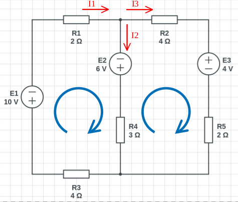

Resolució de circuits (Kirchhoff)
=================================

En general el procediment per resoldre qualsevol circuit aplicant les dues lleis de Kirchhoff. És el següent:

1. Assignem una lletra a cada nus del circuit
2. Es dibuixen les intensitats per cada branca assignant-los un sentit a l'atzar.
3. S'aplica la primera llei de Kirchhoff o la llei dels corrents a tants nusos tingui el circuit menys un.
4. S'aplica la segona llei de Kirchhoff o la llei de les tensions a totes les malles del circuit.
5. Tindrem tantes equacions com el nombre d'intensitats tingui el circuit
6. Es resol el sistema d'equacions plantejat, ja sigui pel mètode de substitució, reducció etc.
7. Les intensitats que tinguin signe positiu tenen el mateix sentit que li assignem en el segon pas. Les intensitats amb signe negatiu tenen sentit contrari al valor assignat inicialment i els hem de canviar el sentit.
8. Un cop tenim el valor i el sentit real de totes les intensitats, ja podem fer un balanç de potències i contestar totes les preguntes sobre l'anàlisi del circuit.

### Primera llei de Kirchhoff

La suma de les corrents que entren a un nus és igual a la suma de les corrents que en surten

> 

### Segona llei de Kirchhoff

> 

### Exemple

> 

S'ha d'aplicar la llei dels corrents de Kirchhoff a tants nusos com en tingui el circuit menys un. Tenim 2 nusos. S'aplica al nus superior i queda:

> 
> 
> **A on:**
> 
> + I1 és la intensitat que va de R1 al nus
> + I2 és la intensitat que baixa
> + I3 és la intensitat que va del nus a R2

Ja es té la primera equació. Ara es tenen dues malles, a les que s'imposen dues circulacions amb les que es recorre el circuit de cada malla. En aquest cas s'ha triat el sentit de les agulles del rellotge. Per tant:

> 

Per altra banda

> 

El sistema d'equacions queda definit de la següent manera:

> 

Resolem:

> 

> 

> 

> 

</blockquote>

Les intensitats negatives simplement vol dir que van en sentit contrari al que s'ha suposat inicialment.