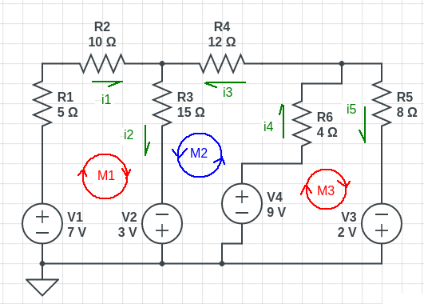

Exercici de Kirchhoff
=====================

Aplicant la primera llei de Kirchhoff:

Aplicant la segona llei de Kirchoff:

Es té un sistema de 5 equacions amb 5 incògnites. Però es possible eliminar ràpidament 2 d'elles, triant adequadament dues variables de les equacions obtingudes amb l'aplicació de la primera llei de Kirchhoff, aïllar-les i substituir-les a les equacions obtingudes amb la segona llei.

Per a fer-ho, es trien les variables i3 i i5, ja que només surten a dues de les equacions de la segona llei.

Ara es substitueixen les variables i3 i i5 a on apareguin.

+15i_2\\\\11=4i_4+8i_5&\rightarrow&11=4i_4+8(i_4+i_1-i_2)\end{array})

Operant:

+15i_2&\rightarrow&12=4i_4+12i_2-12i_1+15i_2\\\\11=4i_4+8(i_4+i_1-i_2)&\rightarrow&11=4i_4+8i_4+8i_1-8i_2\end{array})

Finalment, simplificant i ordenant:

Es pot eliminar una equació amb el mètode de la reducció fent 3 vegades l'equació 2 i restant-li l'equació 3. Es a dir:

\\\\-\\\\&8i_1&-8i_2&+12i_4&=&11\end{array}\right\\}\rightarrow\left.\begin{array}{rrrrcr}&-36i_1&+81i_2&+12i_4&=&36\\\\-\\\\&8i_1&-8i_2&+12i_4&=&11\end{array}\right\\})

Ara, el sistema ja només te dues equacions i dues incògnites.

I novament es pot aplicar el sistema de reducció per eliminar una de les dues, per exemple i1. Per a fer-ho es multiplicarà cada una de les equacions pel factor que multiplica i1 a l'altra és a dir, i es sumaran:

\\\\+\\\\&15&\cdot&(-44i_1+89i_2=25)\end{array}\right\\}\rightarrow\left.\begin{array}{rr}&660i_1+660i_2=440\\\\+\\\\&-660i_1+1335i_2=375\end{array}\right\\})

Ara es pot substituir aquest valor a les anteriors equacions i per tant

