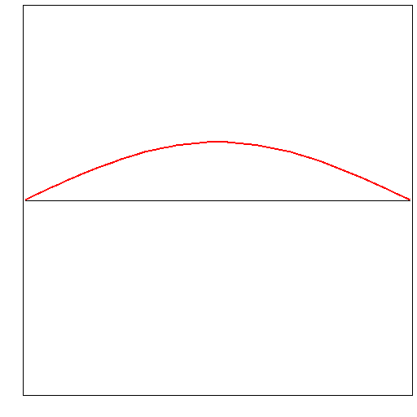
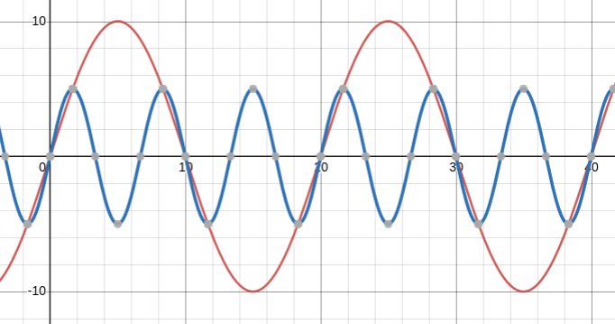
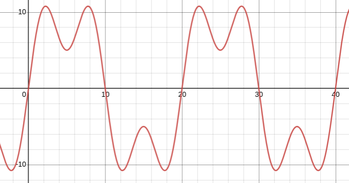
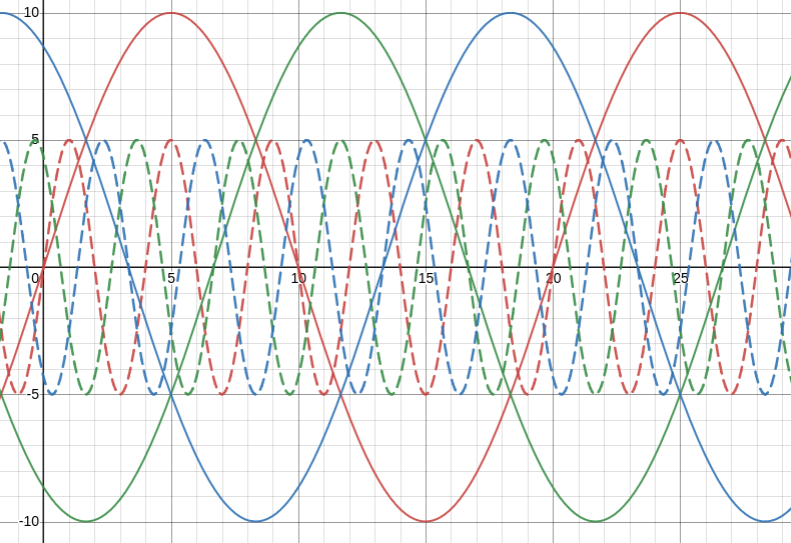
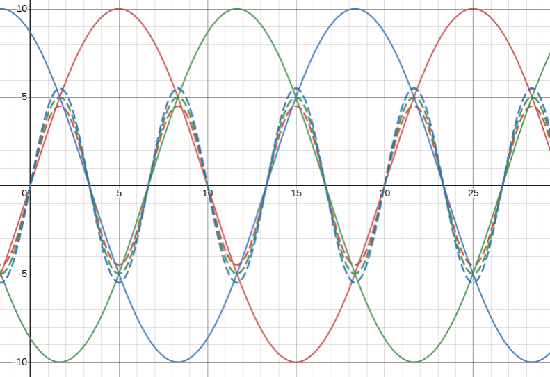
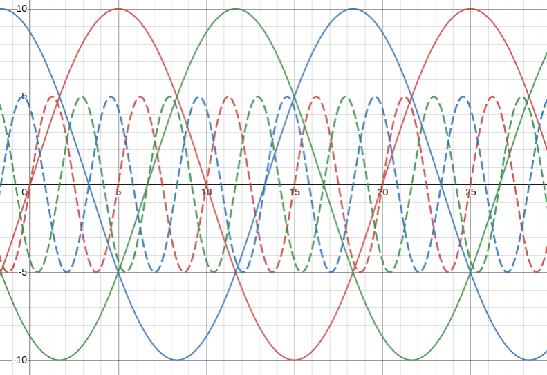

Harmònics
=========

1.- Definició no formal
-----------------------

Tot allò que vibra (una corda d'una guitarra) o que oscil·la (un pèndul), ho fa a una certa freqüència. La freqüència, com s'ha explicat a anteriors unitats és la quantitat de repeticions de la vibració o oscil·lació en una unitat de temps. La freqüència es sòl expressar en hertzs (Hz) que és equivalent a cicles per segon (s⁻¹). En l'àmbit elèctric aquesta freqüència és 50Hz, tot i que hi ha alguns països que utilitzen els 60Hz. Finalment, en alguns casos, com aplicacions militars o aeronàutiques s'utilitzen els 400Hz.

Per a la vibració d'una corda, la freqüència fonamental és aquella a la que vibra la corda, per a la xarxa elèctrica la freqüència fonamental és la freqüència de generació del sistema.

> 
> 
> **Fig. 1** _Mode normal d'una corda_ Imatge creada per [P.wormer], [Normal mode of string], [CC BY-SA 3.0]

No obstant, la corda és capaç de vibrar a altres freqüències superiors, sempre que aquesta sigui múltiple de la fonamental.

> 
>
> **Fig. 2** _Modes de vibració d'una corda_. Imatge creada per: Christophe Dang Ngoc Chan ([cdang]) [Vibration corde trois modes petit], [CC BY-SA 3.0][CC BY-SA 3.0] 

Als sistemes elèctrics succeeix el mateix fenomen tot i que es produeix en l'oscil·lació de la tensió i intensitat que circula pel circuït en lloc d'amb una ona estacionaria a una corda.

> 
>
> **Fig. 3** _Ona fonamental a de 10A i 50Hz amb un tercer harmònic amb HDI3 = 50%._ Creació pròpia (autor Joan Servera), mitjançant la calculadora gràfica [Desmos]

La presencia del tercer harmònic de vist a la _Fig. 3_ provoca l'ona distorsionada de la _Fig.4_

> 
>
> **Fig. 4** _Ona distorsionada per un tercer harmònic_ Creació pròpia (autor Joan Servera), mitjançant la calculadora gràfica [Desmos]

L'ona distorsionada deixa de ser sinusoidal. Segons els treballs de Jean Baptiste Joseph Fourier, tota ona periòdica (es repeteix cada cert període T) es pot descompondre per una suma d'ones sinusoidals de freqüències f1, 2·f1, 3·f1, etc. a on:

>  
>
> **Eq. 1**, a on:
> - **f:** freqüència \[Hz\]
> - **T:** període \[s\]

Als següents vídeos podeu aprendre més sobre la transformada de Fourier i les series de Fourier.

- Què és la transformada de Fourier (<https://youtu.be/spUNpyF58BY>)
- Què són les series de Fourier (<https://youtu.be/r6sGWTCMz2k>)

2.- Distinció entre càrregues lineals i no lineals
--------------------------------------------------

Les càrregues lineals són aquelles que quan s'alimenten per una tensió sinusoidal, per elles circula també una corrents sinusoidal. Per altra banda, una càrrega no lineal genera corrents no sinusoidals al alimentar-les amb la mateixa ona de tensió.

3.- Descomposició harmònica
---------------------------

Donat que qualsevol ona periòdica es pot descompondre en ones sinusoidals múltiples de la freqüència fonamental es pot escriure que:

> =I_0+\sqrt2I_1\cdot\sin(\omega_1t+\varphi_1)+\sqrt2I_2\cdot\sin(\omega_2t+\varphi_2)+...)
>
> **Eq. 2**, a on:
> - **I0:** component continu. En general zero degut a la simetria de la majoria d'ones alternes. \[A\]
> - **Ik:** intensitat eficaç de l'harmònic k-èssim \[A\]
> - **ωk:** velocitat angular de l'ona en \[rad/s\]
> - **φ:** desfasament \[rad\]. 

S'ha de recordar que: 
> 
>
>  **Eq. 3**, a on:
> - **ω1:** velocitat angular de l'ona fonamental \[rad/s\]
> - **f1:** freqüència de l'ona fonamental \[rad/s\]
> - **T:** període de l'ona \[s\]

S'anomena fonamental a l'ona de freqüència f1, segon harmònic a la freqüència f2 o harmònic d'ordre 2, etc.

### 3.1.- Subharmònics i interharmònics

Poden aparèixer a una ona elèctrica senyals sinusoidals periòdiques de freqüències inferiors a la fonamental o de freqüència superior a f1, però que no són múltiples d'aquesta. Són els anomenats subharmònics i interharmònics respectivament. 

### 3.2.- Seqüència dels harmònics

Es defineix un sistema trifàsic no distorsionat i simètric quan totes les ones que corresponen a la corrent de les tres fases són del mateix mòdul i es troben desfasades 120°. Aquest sistema segueix un ordre directe quan les ones passen successivament per un ordre arbitràriament establert, diquem A-B-C.

Llavors el sistema es considera que te una seqüència inversa si l'ordre passa a ser A-C-B.

S'estudiarà a continuació què passa amb les ones del cinquè harmònic a un sistema trifàsic. 

> 
>
> **Fig. 5** _Seqüència del 5è harmònic_ Creació pròpia (autor Joan Servera), mitjançant la calculadora gràfica [Desmos]

Si s'observa la Fig. 5, l'ordre de les ones fonamentals (línies continues) és vermell-verd-blau. Fixant-se en l'ona del cinquè harmònic que cada una d'elles genera (línies discontinues) es pot veure que ara la seqüencia és vermell-blau-verd.

Amb el tercer harmònic (Fig. 6), ocorre que totes les ones és superposen, és el que s'anomena seqüència homopolar. En aquest cas, per a visualitzar millor el fenomen es suposarà que els harmònics tenen amplituds lleugerament diferents.

> 
>
> **Fig. 6** _Seqüència del 3r harmònic_ Creació pròpia (autor Joan Servera), mitjançant la calculadora gràfica [Desmos]

Finalment, per al 4t harmònic la seqüencia és la mateixa que amb les fonamentals com es pot observar a la Fig. 7

> 
>
> **Fig. 7** _Seqüència del 4t harmònic_ Creació pròpia (autor Joan Servera), mitjançant la calculadora gràfica [Desmos]

Aquest fet succeeix repetidament per tots els harmònics de la següent manera:

~~~
    D       I       H
    1       2       3
    4       5       6
    7       8       9
   ...     ...     ...
   3n-2    3n-1     3n
~~~

A on:
- D representa les freqüències amb seqüència directa.
- I representa les freqüències amb seqüència Inversa.
- H representa les freqüències amb seqüència homopolar.

### 3.3.- Mesura de la distorsió

Els valors eficaços de tensió i d'intensitat d'una ona distorsionada es calculen respectivament mitjançant la fórmules següents:

> 
>
> **Eq. 4**, a on U representa les diferents tensions eficaces \[V\].

> 
>
> **Eq. 5**, a on I representa les diferents corrents eficaces \[A\].

Les equacions Eq. 4 i Eq. 5 representen el que mesurarien els voltímetres i amperímetres (aquells que estan preparats per a mesurar ones no sinusoidals perfectes, els anomenats true-RMS).

Per altra banda per a mesurar la presencia d'un harmònic aquest es sol expressar com a coeficient de la fonamental bé en tant per u, bé en tant per cent.

> 
>
> **Eq. 6**, a on U representa les diferents tensions eficaces \[V\].

> 
>
> **Eq. 7**, a on I representa les diferents tensions eficaces \[A\].

Finalment es defineix la distorsió harmònica total (THD) a les Eq. 8 i Eq. 9. S'ha de tenir cura, no obstant, en que el sumatori no inclou la fonamental, és a dir, el sumatori comença a n=2.

> 
>
> **Eq. 8**, a on U representa les diferents tensions eficaces \[V\].

> 
>
> **Eq. 9**, a on I representa les diferents tensions eficaces \[I\].

### 3.4.- Potències

L'expressió d'una ona distorsionada, però composta a l'hora de múltiples ones sinusoidals perfectes de freqüències múltiples de la fonamental es pot representar com:

> =\sum\limits_{n=1}^\infty\sqrt2U_n\cdot\sin(n\cdot\omega_nt+\alpha_n))
>
> **Eq. 10** _valor instantani de la tensió._

> =\sum\limits_{n=1}^\infty\sqrt2I_n\cdot\sin(n\cdot\omega_nt+\beta_n))
>
> **Eq. 11** _valor instantani de la corrent._

Llavors es defineixen les potències, activa (P) i reactiva (Q), com:

> )
>
> **Eq. 12** _potència activa d'una ona distorsionada_ \[W\]

> )
>
> **Eq. 13** _potència reactiva d'una ona distorsionada_ \[VAR\]

Es fa notar en aquest punt que hi ha encara certa polèmica en definir què és la potència reactiva d'aquest tipus d'ones, en aquests apunts s'ha seguit el criteri establert per els professors Boix, Córcoles, Sainz i Suelves del departament d'Enginyeria elèctrica de l'Escola Tècnica d'Enginyers Industrials Superiors de la Universitat Politècnica de Catalunya.

La potencia aparent, per altra banda, es defineix com:

> 
>
> **Eq. 14** _potència aparent d'una ona distorsionada_ \[VA\]

A les ones distorsionades l'equació que relaciona P, Q i S a sistemes amb carregues lineals no és vàlida. En aquell cas la S era la hipotenusa d'un triangle rectangle els catets del quals eren P i Q. Ara, s'afegeix una nova dimensió i per tant S correspon a la diagonal d'un prisma de base rectangular, i angles rectes on les seves arestes corresponen als valos P, Q i D on D és la potencia de distorsió. Per tant:

> 
>
> **Eq. 15** _relació entre les potències_ \[VA\]

O, el que és el mateix:

> 
>
> **Eq. 16** _potència de distorsió_ \[W\]

Finalment, el factor de potencia només es pot definir com:

> 
>
> **Eq. 17** _factor de potència_

4.- Causes dels harmònics
-------------------------

Tots els tipus de carregues que poden crear ones distorsionades es poden classificar en un d'aquest tres tipus de components:

- Arcs de descàrrega, que crearan harmònics no parells, és a dir tindran el 3r, 5è, 7è harmònic.
- Carregues electròniques, principalment els rectificadors amb filtre inductiu que creen harmònics segons la eq. 18 i rectificadors amb filtre capacitiu que no crea harmònics parells
- Càrregues amb inductàncies saturables, com per exemple transformadors.

> 
>
> **Eq. 18** _llei d'harmònics de rectificadors trifàsics amb filtre inductiu_

5.- Harmònics de tensió
-----------------------

La caiguda de tensió al llarg d'una línia deguda a corrents distorsionades donaran lloc a distorsions a la sinusoidal, donat que les cdt instantànies seran directament proporcional a la intensitat instantània de l'ona distorsionada. Aquesta caiguda de tensió tindrà per tant la mateixa forma que la corrent i es restarà a la tensió sinusoidal creada pel generador modificant-la per a tots els usuaris, si bé la THD serà inferior, ja que la caiguda de tensió es troba limitada en general a valors que no superen el 5-7%.

6.- Efectes dels harmònics
--------------------------

Els harmònics creen els següents efectes:

- Microtalls i buits de tensió. Que perjudiquen el funcionament de les fonts d'alimentació d'ordenadors i altres equips electrònics. Per altra banda els buts de tensió provoquen oscil·lacions en el parell dels motos connectats a aquesta xarxa.
- Efectes sobre els condensadors. Les tensions en bornes dels condensadors poden arribar a ser molt elevades si hi ha ressonàncies. Si es preveu la presencia d'harmònics importants pot ser necessari la instal·lació de bobines en serie que actuïn de filtre.
- Efectes en el sobreescalfament dels motors. No s'han d'alimentar motors a xarxes amb més d'un 5% de THD en tensió.
- Errors de mesura, en tant que poden saturar els transformadors de mesura o ser mesurats per aparells preparats només per ones sinusoidal perfectes els quals apliquen correccions vàlides només per aquest tipus d'ones.
- Efectes sobre el cablejat que s'encalentira més per l'efecte _skin_ o efecte pel·licular.
- Circulació d'intensitat pel conductor neutre deguda a la presencia d'harmònics d'ordre 3, 6, 9, etc... Per tant a oficines i a sales amb gran presència d'equips informàtics pot ser necessari sobredimensionar el neutre 1.73 vegades la secció de les fases o més si les carregues no estàn equilibrades. O bé instal·lar un conductor neutre diferent per a cada fase per a aquestes càrregues monofàsiques.
- Vibracions audibles.
- Finalment si la inductància del neutre és elevada, la corrent pot tenir tendència a circular per terra en lloc de pel neutre.

7.- Solucions per a mitigar els problemes dels harmònics
--------------------------------------------------------

Les sol·lucions per a mitigar els efectes dels harmònics és complexa, ja que l'ús de filtres pot fer aparèixer freqüències de ressonància que crein tensions molt elevades. A més els harmònics no són constants i varien depenent de les carregues que entren en funcionament. Sigui com sigui s'enumeren a continuació algunes de les sol·lucions:

- Ús de filtres
- Ús de transformadors
- Línies dedicades
- Terres aillades
- Supressors de sobretensions
- Estabilitzadors
- SAIs

<!-- Links ===============================================================-->

[Desmos]: https://www.desmos.com/calculator

[P.wormer]: https://commons.wikimedia.org/wiki/User:P.wormer

[Normal mode of string]: https://commons.wikimedia.org/wiki/File:Normal_mode_of_string.gif

[cdang]: https://commons.wikimedia.org/wiki/User:Cdang

[Vibration corde trois modes petit]:https://commons.wikimedia.org/wiki/File:Vibration_corde_trois_modes_petit.gif "Vibration corde trois modes petit"

[CC BY-SA 3.0]: https://creativecommons.org/licenses/by-sa/3.0/legalcode "licence"

