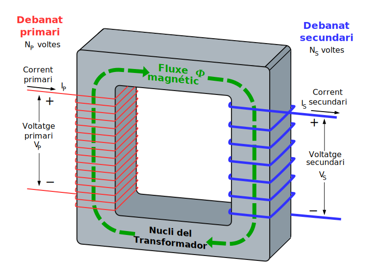
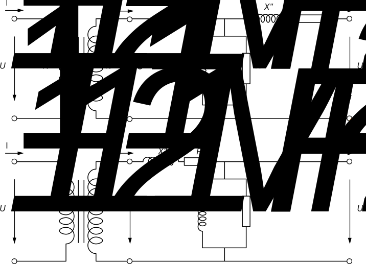
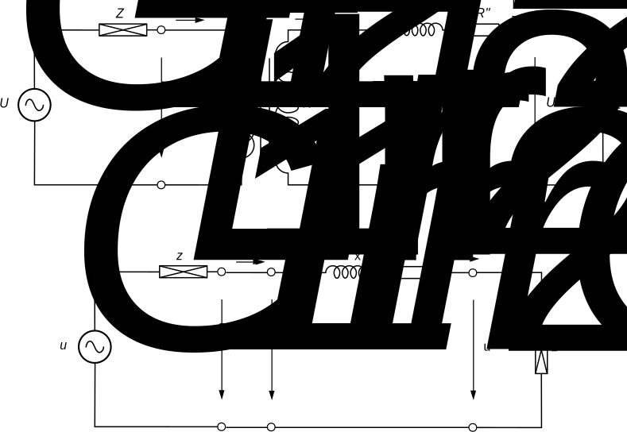

Transformadors
==============

1.- Introducció
---------------

Un transformador és una màquina elèctrica estàtica que transmet energia elèctrica d'un circuit a un altre, modificant la tensió (u₁) i la corrent (i₁) del circuit anomenat primari a la tensió (u₂) i la corrent (i₂) del circuit anomenat secundari.

Bàsicament, està format per dos o més circuits elèctrics acoblats magnèticament mitjançant un flux comú, és a dir, per dues o més bobines acoblades. El de dues bobines acoblades es diu transformador monofàsic.

Per a aconseguir un flux comú entre les bobines es pot utilitzar un nucli d'aire, encara que resulta molt més adequat utilitzar un nucli de ferro o un altre material ferromagnètic (en aquest cas, el camí a través de l'aire també existeix, però és negligible). Per a que un bobinat indueixi tensió a l'altre, el flux comú ha de ser variable i, per això, també ha de ser-ho la corrent que el crea (amb corrent contínua constant no es pot induir tensió).

Com altres màquines elèctriques, el transformador és reversible. Això vol dir que també es pot alimentar pel costat u₂, i₂ cedir energia al costat u₁, i₁. Sovint es considera que el primari del transformador és el costat que es connecta a l'alimentació (a tensió) mentre que el secundari és el que es connecta al consum, és a dir, la transferència de potència és del primari al secundari. No obstant això, aquesta definició té una certa ambigüitat en el cas de transformadors connectats en xarxes mallades, en els quals la transferència de potència es pot produir en qualsevol dels dos sentits, depenent de com es distribueixi la potència de tota la xarxa.

El transformador no modifica la freqüència de les tensions i corrents, per la qual cosa la freqüència de les tensions i corrents del secundari serà la mateixa que les del primari.

L'aplicació més significativa dels transformadors és en els sistemes elèctrics de potència, en els quals fa possible que la generació, el transport i el consum es facin a les tensions més rendibles en cada cas. També s'utilitza en circuits de baixa potència i tensió per a altres aplicacions com, per exemple, la igualació de les impedàncies de càrrega i font per tenir la màxima transferència de potència, l'aïllament de circuits o l'aïllament front a la corrent contínua, sense perdre la continuïtat de la corrent alterna. Una altra aplicació és com a dispositiu auxiliar dels aparells de mesura, reduint la tensió o corrent d'un circuit per adequar-la a la que accepten els aparells de mesura: són els transformadors de mesura.

2.- El transformador monofàsic
------------------------------

Les tensions nominals del primari i secundari, UN1 / UN2, juntament amb la seva potència nominal, SN, caracteritzen el transformador, i a partir d'aquests valors es poden calcular les corrents nominals, IN1 / IN2 

Els valors nominals són aquells pels quals s'ha calculat el transformador, i superar-los comporta el risc de danyar-lo. La distinció entre l'enrotllament d'alta i baixa tensió, així com si el transformador és elevador (400V / 6 kV) o reductor (25 / 6 kV), depèn de quina de les tensions nominals sigui més gran.

La relació de transformació es defineix com el quocient entre les tensions nominals del primari i el secundari, el qual coincideix amb el quocient entre les espires d'ambdós enrotllaments i és inversament proporcional al quocient entre les corrents nominals.

### 2.1. Transformador monofàsic ideal

Tot i que el transformador ideal no existeix, serveix com una primera aproximació per explicar el funcionament del transformador real. Un transformador monofàsic ideal, representat a la Figura 2, consta de dues bobines acoblades amb les següents característiques:

- Els enrotllaments no tenen resistència interna.
- No hi ha flux de dispersió, és a dir, tenen un acoblament perfecte.
- El nucli magnètic manca de cicle d'histèresi i no hi ha corrents de Foucault (sense pèrdues en el ferro); 
- el mitjà magnètic té una permeabilitat relativa infinita.

En el transformador ideal, es compleix la següent relació:

}{u_{2}(t)}=\frac{i_{2}(t)}{i_{1}(t)})

Aquesta expressió mostra que la relació entre les tensions instantànies del primari i secundari, u₁(t) u₂(t), és constant i és igual al quocient del nombre d'espires d'ambdós enrotllaments (és a dir, la relació de transformació). El mateix succeeix amb les intensitats instantànies del secundari i primari, i₂(t), i₁(t).

L'expressió de la relació de tensions, u₁(t) / u₂(t)=rt, s'obté fàcilment ja que el transformador ideal no té flux de dispersió ni resistència interna als seus enrotllaments. A més, com que no té pèrdues ni emmagatzema energia en forma de camp elèctric o magnètic la potència instantània neta que s'absorbeix és nul·la. Això equival a dir que la potència instantània que absorbeix el primari, p(t), es cedeix instantàniament al secundari i viceversa:

=u_{1}(t)\cdot%20i_{1}(t)=u_{2}(t)\cdot%20i_{2}(t))

D'aquesta equació i de la relació de tensions, u₁(t) / u₂(t) = rt, s'obté la relació entre les intensitats instantànies de primari i secundari: i₂(t) / i₁(t) = rt

Atès que la relació entre tensions i intensitats instantànies és un nombre real constant, si les tensions i intensitats del primari són sinusoidals, també ho seran les del secundari (seran tensions i intensitats de valor eficaç, proporcionals a la relació de transformació, de la mateixa freqüència i de igual fase que les corresponents del primari). Fasorialment es pot escriure,

Les tensions de primari i secundari d'un transformador ideal compleixen la relació de transformació mentre que, com es veurà en punts posteriors, en un transformador real no la compleixen (només si està en buit; quan està en càrrega, la relació entre les tensions varia lleugerament, a causa de la caiguda de tensió a la impedància de curtcircuit). La relació de transformació en el transformador ideal també és igual a la relació entre intensitats, cosa que tampoc passa en el transformador real (excepte si es menysté la branca del ferro).

Per a il·lustrar la forma de treballar amb el transformador ideal, es pot suposar que es disposa d'un transformador ideal monofàsic de 6 kV/380 V, 10 kVA connectat a una xarxa de 6 kV i que alimenta una càrrega de potència activa P=5 kW amb un factor de potència de 0.9.

Abans d'iniciar qualsevol càlcul, es pot comprovar que la tensió d'alimentació no supera la tensió nominal del transformador i que la potència que ha de transferir és inferior també a la nominal,

Utilitzant la relació de transformació, es pot determinar la tensió als borns de la càrrega,

S'observa que el transformador ideal transforma la tensió que se li aplica a l'entrada en una altra tensió a la sortida, segons la relació de transformació (en aquest cas, per cada 6000 V a l'entrada, es tenen 380 V a la sortida).

Coneguda la tensió als borns de la càrrega, es pot determinar la intensitat absorbida per aquesta,

I a partir d'aquesta intensitat es pot determinar la intensitat del primari del transformador utilitzant la relació de transformació,

De la mateixa manera que succeeix amb les tensions, el transformador ideal ajusta les corrents segons la relació de transformació. A més a més, es pot observar que la intensitat en el costat del transformador amb un nivell de tensió més alt serà menor que la del costat amb un nivell de tensió més baix (bobinat d'alta), mentre que la intensitat més elevada estarà en l'enrotllament amb un nivell de tensió més baix (bobinat de baixa).

Cal destacar que treballar amb transformadors implica l'existència de dos circuits diferents corresponents als dos costats del transformador, cadascun amb un nivell de tensió específic assignat. Per exemple, no és el mateix considerar una càrrega de 10Ω al costat de baixa (UN2 = 380 V) que tractar-la al costat d'alta (UN1 = 6 kV).

Es podria dur a terme un exercici senzill per a calcular les corrents i tensions dels petits transformadors domèstics (220/125 V, 200 VA) que encara es troben en instal·lacions antigues. Això es podria aconseguir coneixent la tensió d'alimentació (220 V a l'endoll) i els dispositius connectats al secundari (com ara estufes, batedores, etc.). És important tenir present que aquests transformadors s'allunyen molt més de la idealitat en comparació amb un transformador de alta potència.

Es fa notar que el secundari i el primari del transformador estan elèctricament separats, és a dir, no hi ha cap punt en els seus circuits connectat per conductors, i la relació entre tots dos s'estableix a través del circuit magnètic. Aquesta característica es coneix com aïllament galvànic, i permet la separació de qualsevol fenomen elèctric entre el primari i el secundari.

### 2.2 Transformador monofàsic real

El transformador monofàsic real es diferencia de l'ideal pel fet que:
- els bobinats tenen resistència interna, 
- hi ha flux de dispersió en el nucli magnètic, 
- aquest té un cicle d'histèresi i hi ha corrents de Foucault (amb pèrdues en el ferro); 
- a més, el medi magnètic té una permeabilitat relativa finita.

El seu esquema equivalent per al règim permanent sinusoidal és el de la Figura 3. Inclou un transformador ideal, dues resistències i dues reactàncies. La branca formada per RFe'' i XM'' representa el ferro, la potència consumida a RFe'' són les pèrdues al ferro i la intensitat que circula per XM'' és la necessària per a crear el flux magnètic. Aquesta branca sol situar-se al costat de BT. La branca formada per R'' i X'' representa les resistències dels bobinats i la caiguda de tensió deguda al flux de dispersió. La resistència i la reactància de l'esquema corresponen a la suma de la resistència i la reactància del primari i secundari.

La doble prima en les variables indiquen que són variables vistes des del secundari. Normalment, es desestima la branca del ferro per a realitzar els càlculs elèctrics i només es té en compte en calcular les potències activa i reactiva consumides pel transformador. L'esquema resultant és el de la Figura 4.

### 2.3.- Reducció de circuit amb transformador monofàsic ideal

Quan es disposa d'un circuit que inclou un transformador monofàsic ideal (com ara el circuit de la Figura 4, que en conté un d'ideal), no es fan servir directament les equacions associades al transformador (com es va fer a l'exemple anterior). En lloc d'això, es procedeix a eliminar el transformador ideal, un procés conegut com a reducció del circuit. Reduir un circuit implica dividir totes les magnituds del mateix per uns valors base específics. Aquests valors base no poden ser arbitraris, sinó que han de complir amb determinats criteris.

&\\\\[5mm]U_{b1}~(\text{V})&U_{b1}/U_{b2}=r_t&U_{b2}~(\text{V})\\\\[5mm]I_{b1}=\dfrac{S_b}{U_{b1}}~(\text{A})&&I_{b2}=\dfrac{S_b}{U_{b2}}~(\text{A})\\\\[5mm]Z_{b1}=\dfrac{U_{b1}^{2}}{S_b}~(\Omega)&&Z_{b2}=\dfrac{U_{b2}^{2}}{S_b}~(\Omega)\end{array})

Anem a dur a terme la reducció del transformador real representat a la Figura 5a, el qual té el seu primari connectat a través d'una línia i una càrrega al seu secundari. Totes les variables (potències, tensions, intensitats i impedàncies) i components (fonts de tensió o corrent, impedàncies o càrregues) de cada costat del transformador han de ser dividits pel seu corresponent valor base. El circuit resultant és el de la Figura 5b, on es pot observar que el transformador ideal s'ha convertit en dos fils.

El circuit simplificat té l'avantatge de ser més fàcil de resoldre en comparació amb aquell que inclou el transformador ideal. Un cop resolt, és necessari obtenir els valors reals de tensions, corrents i potències desfent les simplificacions realitzades.

De totes les bases possibles, es solen utilitzar:
- la reducció al primari
- la reducció al secundari
- la reducció amb la base referida als valors nominals del transformador, coneguda com reducció a p.u.

Aquesta darrera serà la que s'utilitzarà en aquesta assignatura.

&\\\\[5mm]U_{b1}^{p.u.}=U_{N1}~(\text{V})&U_{b1}^{p.u.}/U_{b2}^{p.u.}=r_t&U_{b2}^{p.u.}=U_{N2}~(\text{V})\\\\[5mm]I_{b1}^{p.u.}=\dfrac{S_N}{U_{N1}}~(\text{A})&&I_{b2}^{p.u.}=\dfrac{S_N}{U_{N2}}~(\text{A})\\\\[5mm]Z_{b1}^{p.u.}=\dfrac{U_{N1}^{2}}{S_N}~(\Omega)&&Z_{N2}^{p.u.}=\dfrac{U_{N2}^{2}}{S_N}~(\Omega)\end{array})

Cada una d'aquestes simplificacions té les seves avantatges. És important assenyalar que com que els valors base tenen unitats els valors reduïts són adimensionals (s'hauria d'indicar p.u.), no obstant per deformació es solen utilitzar unitats (V, A, Ω, VA).

### 2.4.- Placa de característiques del transformador monofàsic

Els **valors nominals** d'una màquina elèctrica són aquells per als quals ha estat dissenyada. Els més importants d'un transformador dissenyat per treballar en règim sinusoidal són:

- Potència nominal.
- Tensió nominal de primari i secundari.
- Intensitat nominal de primari i secundari.
- Relació de transformació.
- Freqüència nominal.

Com en altres màquines elèctriques, la potència màxima que pot subministrar el transformador està limitada per la qualitat dels seus aïllants, els quals poden deteriorar-se per un excés de tensió o temperatura.

La tensió màxima dels aïllants fixa la tensió màxima del transformador.

La temperatura màxima dels aïllants, juntament amb la capacitat de dissipació de calor del transformador, fixa les pèrdues màximes que es poden produir al seu interior (pèrdues en el ferro i en el coure). Per a una tensió determinada (amb pèrdues en el ferro constants) i una secció de conductor determinada (resistència constant, R = ρ · L / S), la temperatura màxima dels aïllants fixa una intensitat màxima al transformador.

La **potència nominal**, representada com a S, és la potència aparent (VA, kVA o MVA) que s'obté a partir de la tensió i la corrent nominals dels dos debanaments del transformador. Pel que fa a un transformador monofàsic, s'expressa de la següent manera:

Es refereix a la capacitat de subministrar potència al secundari del transformador en règim permanent sense que l'escalfament sigui excessiu. Si la càrrega al secundari té un factor de potència igual a la unitat, tota la potencia aparent és, de fet, potència activa; per tant la potència nominal és també la màxima potència activa que pot desenvolupar el transformador. En condicions intermitents de funcionament, com ara connexions i desconnexions periòdiques, el transformador pot subministrar fins a 1,5 vegades la potència nominal. Això es deu al fet que durant el temps de desconnexió, el transformador es refreda fins a la temperatura ambient (o altres intermèdies entre la de funcionament i la ambient), i un transformador pot subministrar potència superior a la nominal mentre es recalenta fins a arribar a la seva temperatura màxima.

Les **tensions nominals**, representades per U, són les tensions per a les quals s'han calculat els debanats del transformador. Aquestes tensions no han de superar-se per evitar el deteriorament dels aïllaments.

Les **corrents nominals**, representades per I, són les corrents màximes que poden circular pels debanaments del transformador sense deteriorament. En condicions intermitents, es poden admetre sobrecàrregues.

La **relació de transformació** és la proporció entre les tensions nominals primària i secundària. Aquesta relació es manté fins i tot quan la primària està alimentada i la secundària està en buit (sense càrrega). Coincideix amb la relació entre el nombre d'espires de primària i secundària, inversament proporcional a la relació de tensions.

La **freqüència nominal** és la freqüència corresponent a la resta dels valors nominals.

Els valors nominals d'un transformador són els valors de funcionament estàndard, però també pot funcionar correctament amb altres valors diferents. Per exemple:

- Pot subministrar potències inferiors a les nominals (les potències estan limitades per la càrrega), o el que és el mateix, pot subministrar intensitats inferiors a les nominals, que és el que normalment succeeix.

- Pot treballar amb tensions inferiors a les nominals, encara que no podrà subministrar llavors la potència nominal (tot i que sí podrà subministrar la intensitat nominal).

- Pot treballar amb una altra freqüència f, tot i que si és superior a la nominal, es produiran majors pèrdues al nucli de ferro, la qual cosa reduirà la potència màxima a menys de la nominal. Si és inferior, la corrent magnetitzant o el flux seran majors. Per evitar la saturació del transformador, caldrà treballar amb una tensió U inferior a la nominal, complint així amb les especificacions.

La **placa de característiques** d'un transformador conté, entre d'altres, els següents valors.

dfaefaw f aefa f wfwefawef efwaefwefwefqwef aegaef efawefawe gagae efw fsf fscfg 2134kW