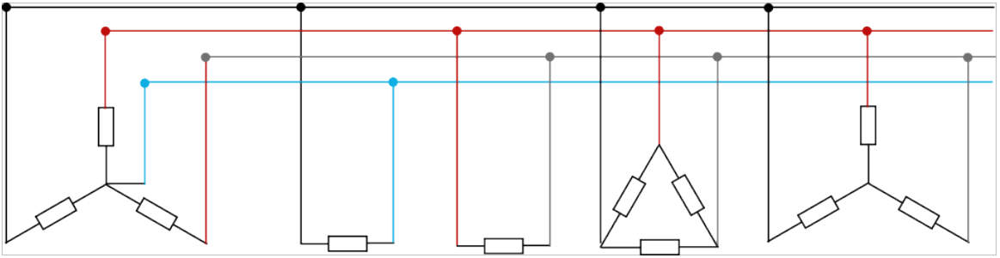

# Exercici 1 - Sistemes trifàsics

## Formulari

Si connexió és en estrella

$$
\begin{gather}
V_L = \sqrt{3} V_F    &    ;    &    I_L = I_F
\end{gather}
$$

Si connexió és en triangle

$$
\begin{gather}
V_L = V_F    &    ;    &    I_L = \sqrt{3} I_F
\end{gather}
$$

Llei d'Ohm és en trifàsic.

$$
\begin{gather}
V_F = Z \cdot I_F
\end{gather}
$$

## Enunciat

Observa les següents càrregues connectades a un transformador trifàsic en estrella:

La tensió de fase d'aquest transformador és [[p1]] V. D'aquest transformador surt una línia trifàsica amb neutre cap a una sèrie d'instal·lacions receptores.

- La primera és un subministrament monofàsic (fase i neutre). Quina tensió mesuraré a les bornes de la càrrega? (0,5 punts) 
[[i1]] V

- La segona és és un subministrament monofàsic (fase i neutre). Quina tensió mesuraré a les bornes de la càrrega? (0,5 punts) 
[[i2]] V

- La tercera és un receptor trifàsic connectat en triangle:
  
    - Quina és la tensió de línia? (0,5 punts) 
    [[i3]] V
    - Quina és la tensió de fase? (0,5 punts) 
    [[i4]] V

- La quarta és un receptor trifàsic endollat a una presa de la paret sense neutre, connectat en estrella:
  
    - Quina és la tensió de línia? (0,5 punts) 
    [[i5]] V
    - Quina és la tensió de fase? (0,5 punts) 
    [[i6]] V

- Tant el motor connectat en triangle com el que està connectat en estrella tenen una resistència de [[p2]] Ω. Quina serà la intensitat en A que circula per la resistència?
  
    - Pel receptor en triangle (0,5 punts) 
    [[i7]] A
    - Pel receptor en estrella (0,5 punts) 
    [[i8]] A

- Quina intensitat circularan pels conductors que surten del transformador si no tenim en compte les càrregues monofàsiques? (1 punt) 
[[i9]] A

## Identificació de l'alumne:

[[identificacio]]

